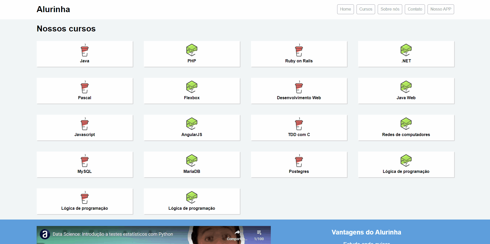

<main>
    <h1 align="center">Projeto Alurinha</h1>
    

        <a href="#sobre">Sobre</a> •
        <a href="#tabela-de-conteudo">Tabela de Conteúdo</a> •
        <a href="#tecnologias">Tecnologias</a> •
        <a href="#certificado">Certificado</a>
    

</main>

<section id="sobre">
    <h2 style="font-size: 1.25rem;">Sobre</h2>
    
Os estudos <b>deste repositório</b> foram feitos de acordo com o curso <a href="https://cursos.alura.com.br/course/posicione-elementos-com-flexbox">Flexbox: Posicione Elementos na Tela</a> com <b>auxílio</b> do instrutor <b>Yuri Padilha</b>.

    
É um site que apresenta jogos, aplicativos, plataformas e lançamentos que estão em alta.

    
Com isso, quero enfatizar que o <b>conteúdo este repositório foi um estudo</b>! Não o criei sozinho, mas todo o conhecimento fornecido vou absorvido.

    
Para ver o site que viu no gif, clique <a href="https://alurinha.ebarbozadev.vercel.app">aqui</a>.

</section>

<section id="tabela-de-conteudo">
    <h2 style="font-size: 1.25rem;">Tabela de Conteúdo</h2>
    <ul style="text-align: justify;" align="justify">
        <li>Especificação flexible box para posicionar seus elementos na página;</li>
        <li>Diversas propriedades do flexbox e como usá-las;</li>
        <li>Propriedades do flexbox substituem <code>float</code>, <code>inline</code> e <code>inline-block</code>;</li>
        <li>Site responsivo com flexbox.</li>
    </ul>
</section>

<section id="tecnologias">
    <h2 style="font-size: 1.25rem;">Tecnologias</h2>
    <ul>
        <li>HTML5;</li>
        <li>CSS3.</li>
    </ul>
</section>

<section id="certificado">
    <h2 style="font-size: 1.25rem;">Certificado</h2>
    
Veja o certificado que obtive no curso! Ou veja online <a href="https://cursos.alura.com.br/certificate/81ef9948-78d5-4483-b4e8-5fd5f8375412">aqui</a>.

</section>
